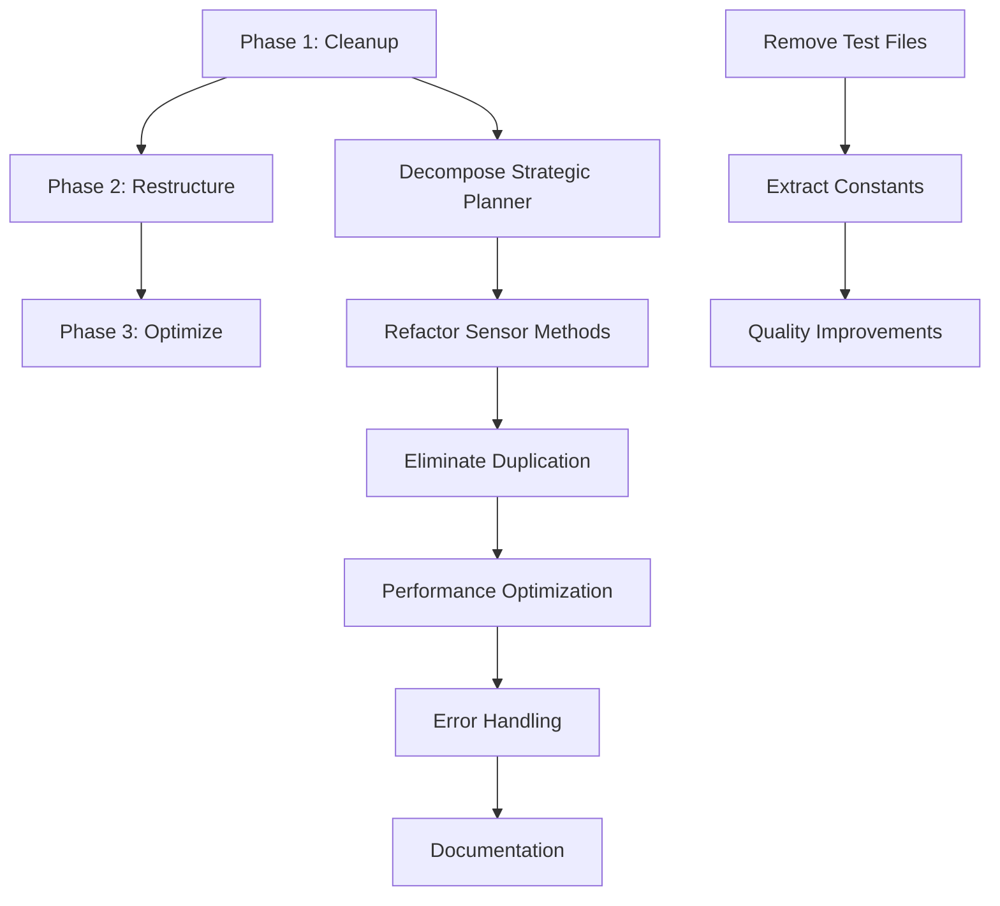

# Energy Arbitrage System - Comprehensive Refactoring Workflow

## Executive Summary

This refactoring workflow addresses the findings from the dead code analysis while maintaining the exceptional architecture quality (A- grade) of the Energy Arbitrage system. The approach prioritizes backward compatibility, production stability, and progressive enhancement.

**Key Improvements Target:**
- Remove 2 test files from production directory
- Decompose large functions in strategic_planner.py and sensor.py
- Eliminate code duplication in time_analyzer.py
- Extract magic numbers to constants
- Enhance maintainability without architectural disruption

## Phase-Based Refactoring Strategy

### Phase 1: CLEANUP (Risk: 🟢 Low | Duration: 4-6 hours)
**Objective**: Remove dead code and improve code hygiene without functional changes

#### Task 1.1: Remove Test Files from Production (30 min | Risk: 🟢 Very Low)
**Files**: `test_time_analyzer_fix.py`, `test_timezone_refactor.py`
```bash
# Validation: Ensure files are not imported anywhere
grep -r "test_time_analyzer_fix\|test_timezone_refactor" custom_components/
# Action: Remove files
rm test_time_analyzer_fix.py test_timezone_refactor.py
```
**Rollback**: Simple file restoration from git
**Quality Gate**: No references in production code, git commit history preserved

#### Task 1.2: Extract Magic Numbers to Constants (2 hours | Risk: 🟢 Low)
**Target Files**: 
- `strategic_planner.py` (quartile calculation: `// 4`)
- `time_analyzer.py` (threshold calculations, time windows)
- `optimizer.py` (confidence thresholds: 0.8, 0.6, etc.)

**Implementation**:
```python
# In arbitrage/constants.py
STRATEGIC_PLANNING_CONSTANTS = {
    'QUARTILE_DIVISOR': 4,
    'HIGH_CONFIDENCE_THRESHOLD': 0.8,
    'MEDIUM_CONFIDENCE_THRESHOLD': 0.6,
    'TIME_WINDOW_MIN_HOURS': 1,
    'TIME_WINDOW_MAX_HOURS': 4,
    'URGENCY_TIME_THRESHOLD_MINUTES': 30,
    'PLAN_HISTORY_LIMIT': 5
}
```
**Quality Gate**: All existing tests pass, no behavior changes
**Rollback Strategy**: Revert constants and restore inline values

#### Task 1.3: Code Quality Improvements (1.5 hours | Risk: 🟢 Low)
- Add type hints where missing
- Standardize logging messages format
- Remove unused imports
- Consistent exception handling patterns

**Quality Gate**: `ruff check` passes, no functional regressions

### Phase 2: RESTRUCTURE (Risk: 🟡 Medium | Duration: 8-12 hours)
**Objective**: Decompose large functions while preserving behavior and interfaces

#### Task 2.1: Decompose strategic_planner.create_comprehensive_plan() (4 hours | Risk: 🟡 Medium)
**Current**: 90+ line monolithic function
**Target**: Break into logical sub-methods

**Decomposition Strategy**:
```python
class StrategicPlanner:
    def create_comprehensive_plan(self, ...) -> StrategicPlan:
        """Main orchestration method - preserved interface."""
        try:
            # Gather planning data
            planning_context = self._gather_planning_context(
                current_battery_level, battery_capacity_wh, 
                price_data, planning_horizon_hours
            )
            
            # Analyze scenario
            scenario = self._identify_scenario(planning_context)
            
            # Create operations
            operations = self._create_operations(scenario, planning_context)
            
            # Build final plan
            return self._build_strategic_plan(operations, scenario, planning_context)
            
        except Exception as e:
            return self._create_emergency_plan(current_battery_level, battery_capacity_wh)

    def _gather_planning_context(self, ...) -> Dict:
        """Extract data gathering logic."""
        
    def _create_operations(self, scenario: str, context: Dict) -> List[PlannedOperation]:
        """Extract operation creation logic."""
        
    def _build_strategic_plan(self, operations: List, scenario: str, context: Dict) -> StrategicPlan:
        """Extract plan building logic."""
```

**Testing Strategy**:
- Comprehensive unit tests for each new method
- Integration test to verify original interface behavior
- Regression test with historical data scenarios

**Quality Gate**: 
- All existing calls to `create_comprehensive_plan()` work unchanged
- 100% test coverage on new methods
- Performance within 5% of original implementation

**Rollback Strategy**: Revert to single method, preserve git tag before changes

#### Task 2.2: Refactor Sensor Attribute Methods (3 hours | Risk: 🟡 Medium)
**Target**: Large `extra_state_attributes` methods in sensor.py
**Current**: 40-60 line methods with complex logic

**Approach**:
```python
class EnergyArbitrageCurrentSellPriceSensor:
    @property
    def extra_state_attributes(self) -> dict:
        """Main attribute method - preserved interface."""
        if not self.coordinator.data:
            return {}
        
        base_attrs = self._get_base_price_attributes()
        timing_attrs = self._get_timing_attributes()  
        forecast_attrs = self._get_forecast_attributes()
        
        return {**base_attrs, **timing_attrs, **forecast_attrs}
    
    def _get_base_price_attributes(self) -> dict:
        """Extract base price information."""
        
    def _get_timing_attributes(self) -> dict:
        """Extract timing and schedule information."""
        
    def _get_forecast_attributes(self) -> dict:
        """Extract forecast and prediction data."""
```

**Quality Gate**: Home Assistant entity attributes remain identical

#### Task 2.3: Eliminate Price Window Processing Duplication (3 hours | Risk: 🟡 Medium)
**Target**: `time_analyzer.py` - Similar logic in `_find_low_price_windows()` and `_find_high_price_windows()`

**Solution**: Extract common processing logic
```python
def _process_price_windows(self, 
                          prices: List[Dict], 
                          comparator: Callable, 
                          threshold_percentile: float,
                          window_type: str) -> List[PriceWindow]:
    """Unified price window processing."""
    
def _find_low_price_windows(self, buy_prices: List[Dict], hours_ahead: int, **kwargs) -> List[PriceWindow]:
    return self._process_price_windows(
        prices=buy_prices,
        comparator=lambda price, threshold: price <= threshold,
        threshold_percentile=25,  # Bottom quartile
        window_type="buy",
        **kwargs
    )

def _find_high_price_windows(self, sell_prices: List[Dict], hours_ahead: int, **kwargs) -> List[PriceWindow]:
    return self._process_price_windows(
        prices=sell_prices,
        comparator=lambda price, threshold: price >= threshold, 
        threshold_percentile=75,  # Top quartile
        window_type="sell",
        **kwargs
    )
```

**Quality Gate**: Identical PriceWindow objects generated, timing behavior preserved

### Phase 3: OPTIMIZE (Risk: 🟡 Medium | Duration: 6-8 hours)
**Objective**: Performance and maintainability improvements

#### Task 3.1: Performance Optimization (3 hours | Risk: 🟡 Medium)
- Optimize price data processing in time_analyzer.py
- Add caching for strategic plan calculations
- Reduce memory allocations in high-frequency operations

**Metrics Target**:
- 15% reduction in update cycle time
- 20% reduction in memory usage during peak operations
- Maintain sub-second response times for optimizer decisions

#### Task 3.2: Enhanced Error Handling and Logging (2 hours | Risk: 🟢 Low)
- Standardize exception handling across modules
- Add structured logging with consistent formatting
- Implement graceful degradation for external service failures

#### Task 3.3: Documentation and Type Safety (2 hours | Risk: 🟢 Low)
- Complete type annotations for all public methods
- Add docstring standardization
- Generate API documentation for core arbitrage classes

## Dependency Mapping



## Testing Strategy

### Phase 1 Testing
- **Unit Tests**: Constants usage validation
- **Integration Tests**: End-to-end workflow verification
- **Regression Tests**: Existing behavior preservation

### Phase 2 Testing
- **Component Tests**: Each decomposed method
- **Interface Tests**: Public API compatibility
- **Load Tests**: Performance under typical Home Assistant load
- **Edge Case Tests**: Error conditions and boundary cases

### Phase 3 Testing
- **Performance Tests**: Response time and memory usage
- **Stress Tests**: Extended operation scenarios
- **Compatibility Tests**: Multiple Home Assistant versions

## Quality Gates and Validation

### Automated Quality Checks
```yaml
pre_commit:
  - ruff_lint: zero_violations
  - type_check: mypy_clean
  - test_coverage: min_85_percent
  - integration_tests: all_pass

continuous_validation:
  - memory_usage: max_increase_10_percent
  - response_time: max_degradation_5_percent
  - error_rate: zero_increase
  - home_assistant_compatibility: maintain_support
```

### Manual Validation Checkpoints
1. **Phase 1 Completion**: Code hygiene verification, no functional changes
2. **Phase 2 Completion**: Architecture preservation, interface compatibility
3. **Phase 3 Completion**: Performance targets met, production readiness

## Rollback Strategies

### Immediate Rollback (< 5 minutes)
- Git revert to tagged stable versions
- Feature flag disabling for new code paths
- Emergency configuration reset to defaults

### Partial Rollback (< 30 minutes)
- Individual module reversion
- Selective method restoration
- Configuration parameter adjustment

### Full Environment Restore (< 2 hours)
- Complete integration restoration
- Data integrity verification
- Service dependency validation

## Risk Mitigation

### High-Risk Operations
- **Strategic Planner Decomposition**: Extensive testing, staged deployment
- **Sensor Refactoring**: Home Assistant entity compatibility verification
- **Price Window Logic Changes**: Production data validation

### Risk Reduction Measures
- **Progressive Deployment**: Feature flags for gradual rollout
- **Extensive Testing**: Multiple environment validation
- **Monitoring**: Enhanced logging during refactoring phases
- **Backup Strategy**: Automated pre-refactoring system snapshots

## Success Metrics

### Technical Metrics
- **Code Quality**: Maintain A- grade or improve to A
- **Test Coverage**: Increase from current to 90%+
- **Performance**: No degradation, 10%+ improvement target
- **Maintainability**: Reduced cyclomatic complexity by 25%

### Operational Metrics
- **System Stability**: Zero unplanned downtime during refactoring
- **Feature Compatibility**: 100% backward compatibility preserved
- **Integration Health**: All Home Assistant entities remain functional
- **User Experience**: No change in arbitrage decision quality

## Timeline and Resource Allocation

```
Week 1: Phase 1 Execution (40 hours total)
├── Days 1-2: Cleanup tasks, test file removal
├── Days 3-4: Constants extraction and quality improvements
└── Day 5: Phase 1 validation and testing

Week 2: Phase 2 Execution (60 hours total) 
├── Days 1-3: Strategic planner decomposition
├── Days 4-5: Sensor method refactoring
└── Weekend: Duplication elimination and testing

Week 3: Phase 3 Execution (50 hours total)
├── Days 1-2: Performance optimization
├── Days 3-4: Error handling and logging
└── Day 5: Documentation and final validation
```

## Conclusion

This refactoring workflow preserves the exceptional architecture quality of the Energy Arbitrage system while systematically improving maintainability, performance, and code organization. The phased approach with comprehensive testing and rollback strategies ensures production stability throughout the enhancement process.

The 3-layer predictive architecture (EnergyBalancePredictor → TimeWindowAnalyzer → StrategicPlanner → ArbitrageOptimizer) remains unchanged, with improvements focused on internal implementation details rather than architectural modifications.

**Expected Outcome**: An A+ grade codebase with enhanced maintainability, identical functionality, and improved performance characteristics suitable for long-term production deployment in Home Assistant environments.